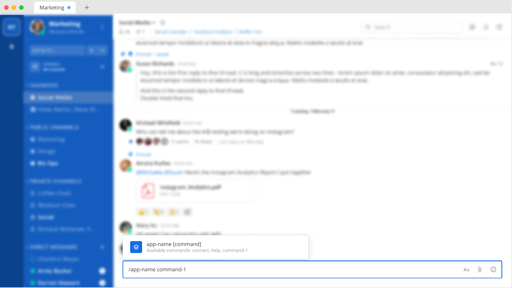
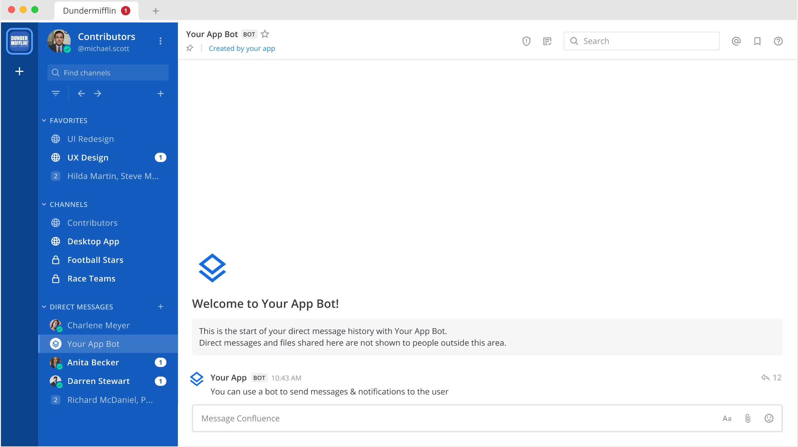
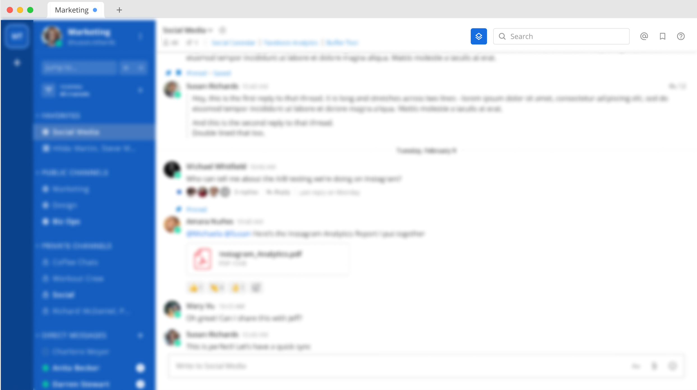
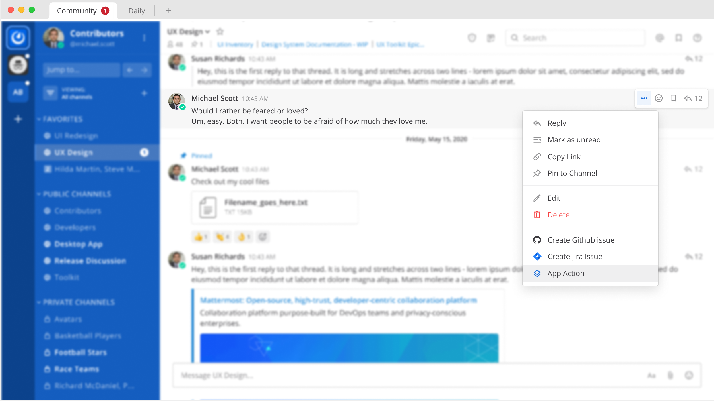

Apps are lightweight, interactive add-ons to Mattermost which can use any HTTP-compatible hosting mechanism to run without dedicated infrastructure. Apps can:

- Display interactive, dynamic Modal forms and Message Actions.
- Be written in any language.
- Attach themselves to locations in the Mattermost user interface (e.g. channel bar buttons, post menu, channel menu, commands), and can add their custom slash commands with full Autocomplete.
- Receive webhooks from Mattermost, and third-parties, and use the Mattermost REST APIs to post messages, etc.
- Work on both Mobile and Desktop clients so developers can focus on the functionality of their apps.
- Be deployed using our serverless hosting infrastructure keeping data secure and supporting scalability by being stateless.
- Include dynamic fields, code as an on-demand function, and interactive modals.

When you develop using the Apps Framework, your apps can:

- Create slash commands

- Post messages to channels

- Add buttons to channel headers and post menus

Apps are available as a Developers Preview and we're looking for your feedback! Share constructive feedback in the [Mattermost Apps channel](https://community.mattermost.com/core/channels/mattermost-apps) on our Mattermost community instance.

* Apps will soon be available for self-managed deployments as well as customers' own AWS environments.

Read the [JavaScript start guide]() or [Go quick start guide]() to learn how to write your first app.

## FAQ

### When would you build an app vs a custom slash command vs a webhook vs a plugin?

That depends on your use case, as they each have benefits.

The built-in [incoming webhook]() is great for simple use cases. It requires the incoming payload to contain a valid [Post](https://pkg.go.dev/github.com/nhannv/mattermost-server/model#Post) JSON object - but some external systems don't allow the customization of the fields included in the webhook payload. Compared to built-in webhooks, an App or plugin can be customized to receive an HTTP webhook posting from another system, and can process the incoming data then augment it or make an actionable message in a channel.

A plugin should be used when you need to [directly alter the UI]() in Mattermost or you have a feature that requires low latency with the server (such as replacing characters in any message [before it is saved]()). Currently, plugins have several [UX hooks]() that Apps cannot access, however we plan to add/migrate more UX hooks into the Apps Framework over time. Please see the [plugin documentation]() for more information.

### What's the difference between the apps framework and the plugin framework?

The App framework provides a few differences from plugins.

- We’ve made our interactive elements easier to use and develop.
- Works on both desktop and mobile clients without any extra code.
- You host the app code or build for Mattermost and distribute through the Marketplace.

### What language should I use to write apps?

Any language you want. We currently have an official driver for Go, and we are planning to release other drivers in the future in conjunction with our community.
