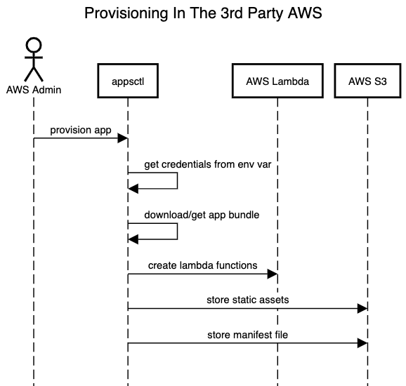
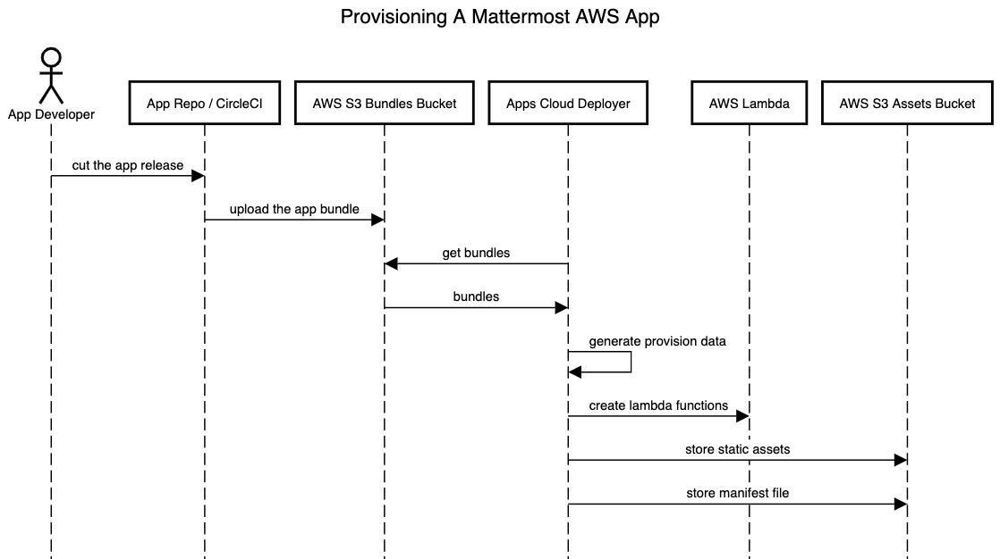

Serverless hosting allows for easy app installation from the App Marketplace by a System Admin and uses AWS Lambda serverless technology instead of relying on a physical server. Developers who create apps using a serverless development approach can easily deploy apps securely, efficiently, and at scale in the Mattermost Cloud.

## Deployment to AWS

### App Bundle

An app bundle is a convenient way to deliver an app to the Mattermost ecosystem. It provides a way to organize code and resources needed for an app to run. An app bundle is created by the developer of the app. Mattermost uses app bundles to provision and install/uninstall apps.

The app bundle contains a `manifest.json` file, a `static/` folder (optional), and one or several lambda function bundles.

- The `static/` folder contains all the static files the app needs. For the Mattermost AWS apps static files are automatically provisioned and stored in the dedicated AWS S3 bucket. Apps have unlimited access to them by providing the static file name to the Apps Plugin. For the third-party hosted AWS apps, static files are stored in the different S3 bucket (specified by the third-party). For the HTTP apps, when creating a server, the developer should store the static files in the `/static/$FILE_NAME` relative URL.
- The `manifest.json` file contains details about the app such as appID, appVersion, appType (HTTP or an AWS app), requested permissions, requested locations, and information about the functions such as function path, name, runtime, and handler.
- Each of the lambda function bundles is a valid and runnable AWS Lambda function, which are provisioned in AWS by the [Mattermost Apps Cloud Deployer](https://github.com/mattermost/mattermost-apps-cloud-deployer). The AWS Lambda function bundle is a `.zip` file which contains scripts or compiled programs and their dependencies. Note that it must be less than 50 MB. Exact specification of the bundle varies for different runtimes. For example one can see more details for `node.js` bundles [here](https://docs.aws.amazon.com/lambda/latest/dg/nodejs-package.html).

### Making your app runnable as an AWS Lambda function

In order for your app to run as an AWS Lambda function it must use of the supported languages for AWS Lambda. You can find the list [here](https://docs.aws.amazon.com/lambda/latest/dg/lambda-runtimes.html).

It's important do design an app in _stateless_ way, as its lifetime only spans one request. No persistent information should be stored except using the [store API endpoints]() provided by Apps Framework.

A language library is used to emulate an HTTP to your app. For go you might use https://github.com/awslabs/aws-lambda-go-api-proxy.

Finally you need to define the AWS function in the manifest of your app by adding an `aws_lambda` to it which has the following fields:

| Name      | Description                                                                                                  |
| :-------- | :----------------------------------------------------------------------------------------------------------- |
| `path`    | The lambda function with its path the longest-matching prefix of the call's path will be invoked for a call. |
| `name`    | A human-readable name.                                                                                       |
| `handler` | The name of the handler function.                                                                            |
| `runtime` | The AWS Lambda runtime to use.                                                                               |

For a go app the manifest snippet would look like this:

```json
{
    "aws_lambda": [
        {
            "path": "/",
            "name": "go-function",
            "handler": "$YOUR_APP_NAME",
            "runtime": "go1.x"
        }
    ]
}
``` 

### Deploying third-party apps to AWS

Note that third-party apps are not supported in the Mattermost Cloud - they're used only for developer testing convenience. Provisioning in the third-party AWS cloud environment is done by the **appsctl** tool using the command:

```bash
go install github.com/mattermost/mattermost-plugin-apps/cmd/appsctl@latest
appsctl provision app /PATH/TO/YOUR/APP/BUNDLE
```

It reads appropriate AWS credentials from environment variables:

`APPS_PROVISION_AWS_ACCESS_KEY`

`APPS_PROVISION_AWS_SECRET_KEY`

We need an app bundle to provision an app. The bundle might be provisioned from the local disk, from S3 (not implemented yet), or from some URL (not implemented yet). Provisioning consists of three parts:

1. Creating the lambda functions with appropriate policies.
2. Storing static assets in the dedicated S3 bucket.
3. Storing app’s manifest file in the same dedicated S3 bucket.

AWS Lambda functions have semantic names, which means that a function described in the manifest.json file translates to AWS as `$appID_$appVersion_$functionName` to avoid collisions with other apps' or other versions' functions. And **appsctl** provisions lambda functions using this name. For example a name of a `servicenow` app's lambda function might be `com-mattermost-servicenow_0-1-0_go-function`. An App developer does not need to worry about the AWS Lambda function names, Apps Plugin takes care of it. Dedicated S3 bucket name is stored in the environment variable:

`MM_APPS_S3_BUCKET`

This also stores all apps' static assets and manifest files.

All files in the static folder of the bundle are considered to be the app's static assets and are stored in the above-mentioned bucket. Stored assets also have semantic keys and are generated using the rule - `static/$appID_$appVersion/filename`. For example the `servicenow` app's static file key can be `"static/com.mattermost.servicenow_0.1.0_app/photo.png"`. You don't need to worry about the static asset keys, as the Apps Plugin takes care of it.

The `manifest.json` file of an app is stored in the same S3 bucket as the key - `manifests/$appID_$appVersion.json`.


### Provisioning in Mattermost Cloud

In order to be provisioned in Mattermost Cloud an app bundle is uploaded to the specific S3 bucket. On a new app release, a bundle is created by GitLab CI and uploaded to S3. The [Mattermost apps cloud deployer](https://github.com/mattermost/mattermost-apps-cloud-deployer), running as a k8s cron job every hour, detects the S3 upload, and creates appropriate lambda functions, assets, and manifest the same way the **appsclt** does for the third-party accounts.

The deployer needs lambda function names, asset keys, and manifest key to provision the app. It calls the `aws.GetProvisionDataFromFile(/PATH/TO/THE/APP/BUNDLE)` from the Apps Plugin to get the provision data. Same data can be generated using the command:

`appsctl generate-terraform-data /PATH/TO/YOUR/APP/BUNDLE`


## HTTP server 

While a serverless infrastructure is the recommended way to host apps, they can be hosted as a traditional HTTP server (for example, using `systemd`). It's important that your app is only reachable by the Mattermost server, and not the public internet.

## Submit to Marketplace

TBD
