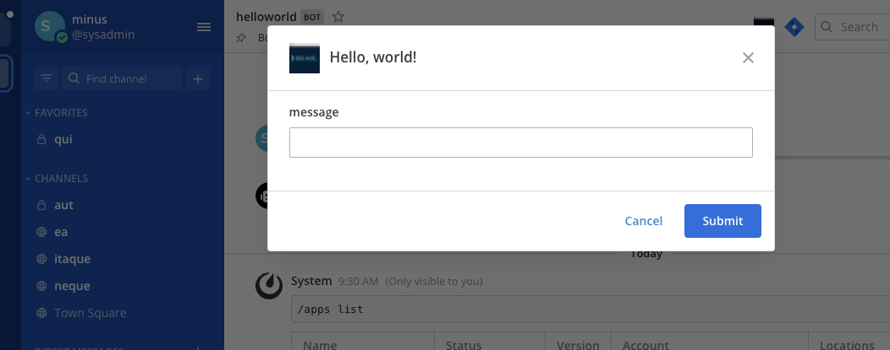

This quick start guide explains the basics of writing a Mattermost app. In this guide you will build an app that:

- Contains a `manifest.json`, declares itself an HTTP application that acts as a bot, and attaches to locations in the user interface.
- Attaches `send-modal` in its `bindings` to a button in the channel header, and `send` to a `/helloworld` command.
- Contains a `send` function that sends a parameterized message back to the user.
- Contains a `send-modal` function that forces displaying the `send` form as a modal.

## Prerequisites

Before you can start with your app, you first need to set up a local developer environment following the [server](/contribute/server/developer-setup/) and [webapp](/contribute/webapp/developer-setup/) setup guides. You must enable the apps feature flag before starting the Mattermost server by setting the enjoinment variable `MM_FEATUREFLAGS_AppsEnabled` to `true` by e.g. adding `export MM_FEATUREFLAGS_AppsEnabled=true` to your `.bashrc`. Please also ensure that `Bot Account Creation` and `OAuth 2.0 Service Provider` are enabled in the System Console.

**Note:** Apps do not work with a production release of Mattermost right now. They can only be run in a development environment. A future release will support production environments.

You also need at least `go1.16` installed. Please follow the guide [here](https://golang.org/doc/install) to install the latest version.

### Install the Apps plugin

The [apps plugin](https://github.com/mattermost/mattermost-plugin-apps)) is a communication bridge between your app and the Mattermost server. To install it on your local server by cloning the code in a directory of your choice:

```bash
git clone https://github.com/mattermost/mattermost-plugin-apps.git
```

Then build the plugin using:

```bash
make dist
```

And upload it via the System Console to your local Mattermost server.

## Building the app

Start building your app by creating a directory for the code and setting up a new go module:

```bash
mkdir my-app
cd my-app
go mod init my-app
go get github.com/mattermost/mattermost-plugin-apps/apps@master
```

### Manifest

Your app has to provide a so-called manifest. The manifest declares App metadata. In this example the *permission* to act as a bot, and to *bind* itself to the channel header, and to `/` commands is requested.

Create a file called `manifest.json` containing:

```json
{
	"app_id": "hello-world",
    "display_name": "Hello, world!",
	"app_type": "http",
	"root_url": "http://localhost:8080",
	"requested_permissions": [
		"act_as_bot"
	],
	"requested_locations": [
		"/channel_header",
		"/command"
	]
}
```

### Bindings and locations

Locations are named elements in the Mattermost user interface. Bindings specify how  an app's calls should be displayed at, and invoked from, these locations.

The app creates a channel header button, and adds a `/helloworld send` command.

Create a file called `bindings.json` containing:
```json
{
	"type": "ok",
	"data": [
		{
			"location": "/channel_header",
			"bindings": [
				{
					"location": "send-button",
					"icon": "http://localhost:8080/static/icon.png",
					"label":"send hello message",
					"call": {
						"path": "/send-modal"
					}
				}
			]
		},
		{
			"location": "/command",
			"bindings": [
				{
					"icon": "http://localhost:8080/static/icon.png",
					"label": "helloworld",
					"description": "Hello World app",
					"hint":        "[send]",
					"bindings": [
						{
							"location": "send",
							"label": "send",
							"call": {
								"path": "/send"
							}
						}
					]
				}
			]
		}
	]
}
```

### Functions and form

Functions handle user events and webhooks. The Hello World app exposes two functions:

- `/send` that services the command and modal.
- `/send-modal` that forces the modal to be displayed.

The functions use a simple form with one text field named `"message"`, the form submits to `/send`.

Create a file called `send_form.json` containing:
```json
{
	"type": "form",
	"form": {
		"title": "Hello, world!",
		"icon": "http://localhost:8080/static/icon.png",
		"fields": [
			{
				"type": "text",
				"name": "message",
				"label": "message"
			}
		],
		"call": {
			"path": "/send"
		}
	}
}
```

## Icons 

Apps may include static assets. One example that was already used above is the `icon` for the two bindings. Static assets must be served under the `static` path.

Download an example icon using:

```
wget https://github.com/mattermost/mattermost-plugin-apps/raw/master/examples/go/helloworld/icon.png
```

### Serving the data

Lastly, create a file named `main.go` with the following contents:

```go
package main

import (
	_ "embed"
	"encoding/json"
	"fmt"
	"net/http"

	"github.com/mattermost/mattermost-plugin-apps/apps"
	"github.com/mattermost/mattermost-plugin-apps/apps/mmclient"
)

//go:embed icon.png
var iconData []byte

//go:embed manifest.json
var manifestData []byte

//go:embed bindings.json
var bindingsData []byte

//go:embed send_form.json
var formData []byte

func main() {
	// Serve its own manifest as HTTP for convenience in dev. mode.
	http.HandleFunc("/manifest.json", writeJSON(manifestData))

	// Returns the Channel Header and Command bindings for the App.
	http.HandleFunc("/bindings", writeJSON(bindingsData))

	// The form for sending a Hello message.
	http.HandleFunc("/send/form", writeJSON(formData))

	// The main handler for sending a Hello message.
	http.HandleFunc("/send/submit", send)

	// Forces the send form to be displayed as a modal.
	http.HandleFunc("/send-modal/submit", writeJSON(formData))

	// Serves the icon for the App.
	http.HandleFunc("/static/icon.png", writeData("image/png", iconData))

	http.ListenAndServe(":8080", nil)
}

func send(w http.ResponseWriter, req *http.Request) {
	c := apps.CallRequest{}
	json.NewDecoder(req.Body).Decode(&c)

	message := "Hello, world!"
	v, ok := c.Values["message"]
	if ok && v != nil {
		message += fmt.Sprintf(" ...and %s!", v)
	}
	mmclient.AsBot(c.Context).DM(c.Context.ActingUserID, message)

	json.NewEncoder(w).Encode(apps.CallResponse{})
}

func writeData(ct string, data []byte) func(w http.ResponseWriter, r *http.Request) {
	return func(w http.ResponseWriter, req *http.Request) {
		w.Header().Set("Content-Type", ct)
		w.Write(data)
	}
}

func writeJSON(data []byte) func(w http.ResponseWriter, r *http.Request) {
	return writeData("application/json", data)
}
```

The apps is a simple HTTP server that serves the files you created above. The only application logic is in `send`, which takes the revived `"message"` field and sends a message back to the user as the bot.

## Installing the App

Run your app using:

```
go run .
```

Then run the following slash commands in our Mattermost server:

```
/apps debug-add-manifest --url http://localhost:8080/manifest.json
/apps install --app-id hello-world
```

Confirm the installation in the modal that pops up. You can insert any secret into the **App secret** field for now.

## Using the App

Select the "Hello World" channel header button, which brings up a modal:



Type `testing` and select **Submit**, you should see:


You can also use the `/helloworld send` command by e.g. typing `/helloworld send --message Hi!`


